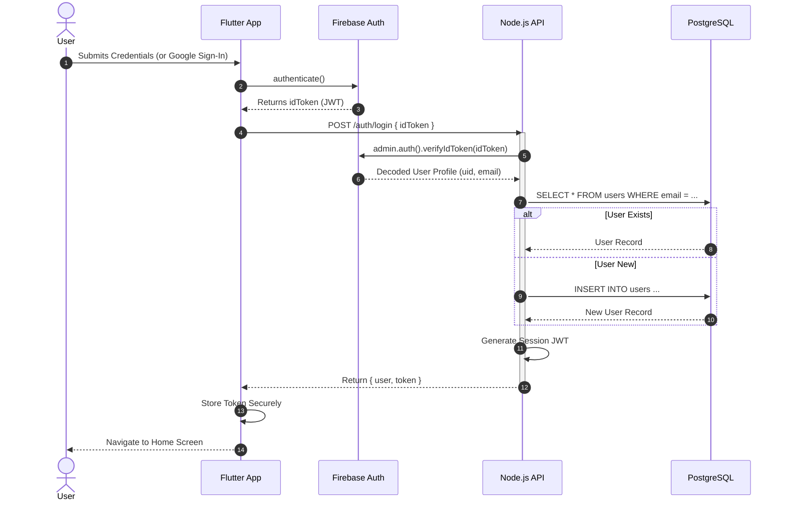
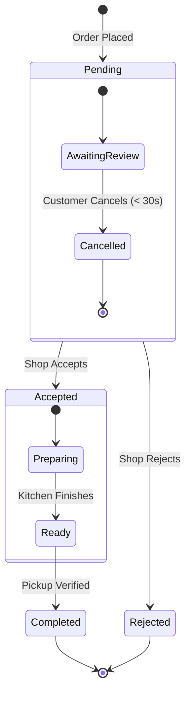

# Behavioral UML Diagrams

This document contains the behavioral diagrams for the **360 Cafe and Outlets** system, modeling how the system behaves and interacts with users.

## 1. Use Case Diagram
This diagram captures the dynamic behavior of the system by illustrating the interactions between the primary actors (Customer, Shop Owner) and the system functionalities.

```mermaid
usecaseDiagram
    actor "Customer" as C
    actor "Shop Owner" as S
    actor "System Admin" as A

    package "Customer App" {
        usecase "Sign In (Google)" as UC1
        usecase "Browse Shops" as UC2
        usecase "Search Products" as UC3
        usecase "Manage Cart" as UC4
        usecase "Place Order" as UC5
        usecase "Track Order Status" as UC6
        usecase "Rate Shop" as UC7
    }

    package "Shop Owner App" {
        usecase "Manage Menu (CRUD)" as UC8
        usecase "Toggle Shop Open/Close" as UC9
        usecase "Receive Order Alert" as UC10
        usecase "Update Order Status" as UC11
        usecase "View Sales Dashboard" as UC12
    }

    package "Backend System" {
        usecase "Authenticate User" as UC13
        usecase "Process Payment" as UC14
        usecase "Send Notifications" as UC15
    }

    C --> UC1
    C --> UC2
    C --> UC3
    C --> UC4
    C --> UC5
    C --> UC6
    C --> UC7

    S --> UC1
    S --> UC8
    S --> UC9
    S --> UC10
    S --> UC11
    S --> UC12

    UC1 ..> UC13 : <<include>>
    UC5 ..> UC14 : <<include>>
    UC11 ..> UC15 : <<include>>
```

## 2. Activity Diagram (End-to-End Order Flow)
This diagram illustrates the step-by-step workflow of an order, using swimlanes to show responsibilities across the Customer, System, and Shop Owner.

```mermaid
activityDiagram-v2
    title End-to-End Order Processing Flow

    |Customer|
    start
    :Open App;
    :Browse Menu;
    :Add Items to Cart;
    :Proceed to Checkout;
    
    if (Cart has items from multiple shops?) then (yes)
        :Show Error "Single Shop Only";
        stop
    else (no)
        :Confirm Order;
    endif

    |System|
    :Validate Stock;
    :Create Order Record (Pending);
    :Broadcast "New Order" Event;

    |Shop Owner|
    :Receive Audio Alert;
    :View Incoming Order;
    
    if (Accept Order?) then (yes)
        :Tap "Accept";
        |System|
        :Update Status to "Preparing";
        :Notify Customer;
    else (no)
        :Tap "Reject";
        :Enter Rejection Reason;
        |System|
        :Update Status to "Rejected";
        :Notify Customer;
        |Customer|
        :Receive Rejection Alert;
        stop
    endif

    |Shop Owner|
    :Kitchen Prepares Food;
    :Mark Order as "Ready";

    |System|
    :Update Status to "Ready";
    :Send "Pickup Now" Notification;

    |Customer|
    :Receive "Ready" Alert;
    :Walk to Counter;
    :Show Order ID;

    |Shop Owner|
    :Verify Order ID;
    :Handover Food;
    :Mark as "Completed";

    |System|
    :Archive Order;
    :Update Sales Stats;
    
    stop
```

## 3. Sequence Diagram (Authentication & Session)
This diagram details the sequence of interactions for a user logging in and establishing a session.



## 4. State Machine Diagram (Order Lifecycle)
This diagram shows the valid states an order can be in and the triggers that cause transitions.


