# System Architecture

The following diagram illustrates the **Overall System Architecture** of 360 Cafe and Outlets, detailing the flow from Apps through the API Gateway, to the Microservices cluster, and finally to the persistence layers.

```mermaid
architecture-beta
    group client_side(cloud)[Consumers]
    service customer_app(mobile)[Customer App] in client_side

    group backend_side(cloud)[Core System]
    service gateway(server)[API Gateway] in backend_side
    service microservices(server)[Microservices] in backend_side
    service db(database)[PostgreSQL] in backend_side
    service media(disk)[Cloudinary] in backend_side

    group shop_side(cloud)[Vendors]
    service shop_app(mobile)[Shop Owner App] in shop_side

    %% Consumer Connection
    customer_app:R -- L:gateway

    %% Vendor Connection
    shop_app:L -- R:gateway

    %% Internal Backend Flow
    gateway:B -- T:microservices
    microservices:B -- T:db
    microservices:R -- L:media
```

