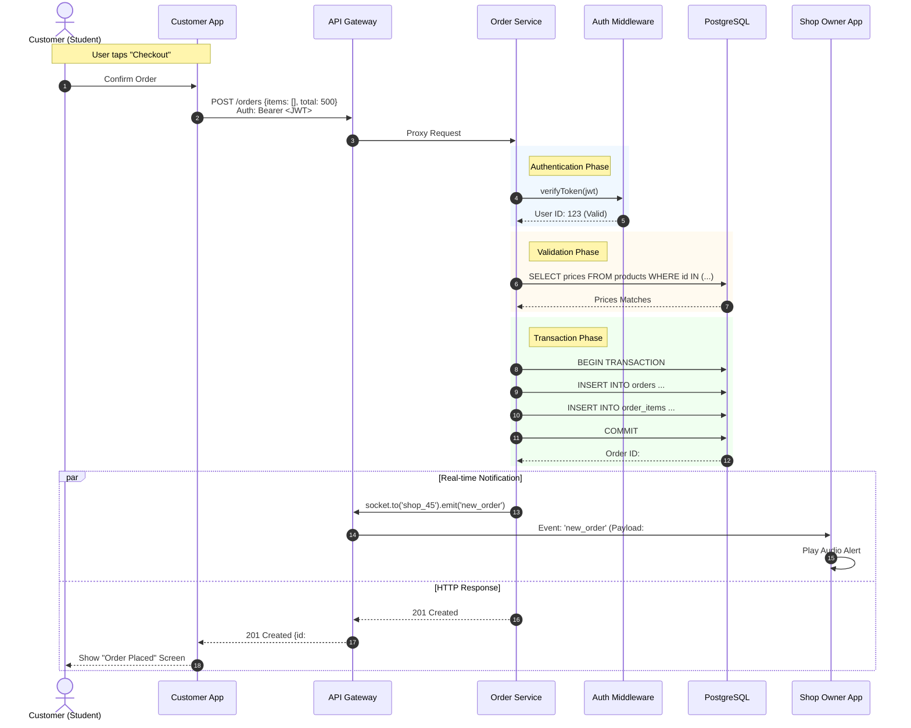

# Mermaid UML Diagrams

Copy and paste the code blocks below directly into [Mermaid Chart](https://www.mermaidchart.com/) or any Mermaid live editor.

## 1. System Architecture (Component Diagram)
This diagram illustrates the Microservices architecture, showing how the mobile apps interact with the backend services via the API Gateway.

```mermaid
graph TD
    %% Styling
    classDef client fill:#f9f,stroke:#333,stroke-width:2px;
    classDef gateway fill:#ff9,stroke:#333,stroke-width:2px;
    classDef service fill:#bbf,stroke:#333,stroke-width:2px;
    classDef db fill:#bfb,stroke:#333,stroke-width:2px;
    classDef ext fill:#ddd,stroke:#333,stroke-width:2px,stroke-dasharray: 5 5;

    subgraph Clients ["Client Layer"]
        CA[Customer App<br/>(Flutter)]:::client
        SOA[Shop Owner App<br/>(Flutter)]:::client
    end

    subgraph API ["API Gateway Layer"]
        GW[API Gateway<br/>Port: 3000]:::gateway
    end

    subgraph Backbone ["Microservices Layer"]
        AS[Auth Service<br/>Port: 3001]:::service
        US[User Service<br/>Port: 3002]:::service
        SS[Shop Service<br/>Port: 3003]:::service
        OS[Order Service<br/>Port: 3004]:::service
    end

    subgraph Data ["Persistence Layer"]
        PG[(PostgreSQL DB)]:::db
    end

    subgraph External ["External Services"]
        FB{Firebase Auth}:::ext
    end

    %% Client Interactions
    CA -- "HTTP/REST & Socket.io" --> GW
    SOA -- "HTTP/REST & Socket.io" --> GW

    %% Gateway Routing
    GW -- "/auth" --> AS
    GW -- "/users" --> US
    GW -- "/shops, /products" --> SS
    GW -- "/orders" --> OS

    %% Internal Service Logic
    AS -- "Verify Token" --> FB
    OS -- "Socket Events" -.-> GW

    %% Database Connections
    AS -- "Read/Write Users" --> PG
    US -- "Read/Write Profiles" --> PG
    SS -- "Read/Write Menus" --> PG
    OS -- "Transact Orders" --> PG

    %% Cross-Service dependencies (conceptual)
    OS -.-> US
```

## 2. Order Placement Flow (Sequence Diagram)
This diagram details the "Place Order" process, including Token Verification, Database Transactions, and Real-time WebSocket events.



## 3. Order Lifecycle & Shop Logic (State Diagram)
This diagram models the strict business rules governing an order's state, including the specific triggers for status changes.

```mermaid
stateDiagram-v2
    [*] --> Pending: Customer places order
    
    state Pending {
        [*] --> AwaitingAction
        AwaitingAction --> Cancelled: Customer cancels (within 30s)
        Cancelled --> [*]
    }

    Pending --> Accepted: Owner taps "Accept"
    Note on link: Notify Customer\n"Order Accepted"

    Pending --> Rejected: Owner taps "Reject"
    Note on link: Guard: Must provide reason\n(e.g., Out of Stock)

    state Rejected {
        [*] --> LogRejection
        LogRejection --> [*]
    }

    Accepted --> Preparing: Auto-transition / Manual
    
    state Preparing {
        [*] --> Cooking
        Cooking --> Packing
        Packing --> [*]
    }

    Preparing --> Ready: Kitchen marks "Done"
    Note on link: Notify Customer\n"Order Ready for Pickup"

    Ready --> Completed: Owner verifies Handover
    Note on link: Guard: Payment Confirmed

    Completed --> [*]
    Rejected --> [*]
```
